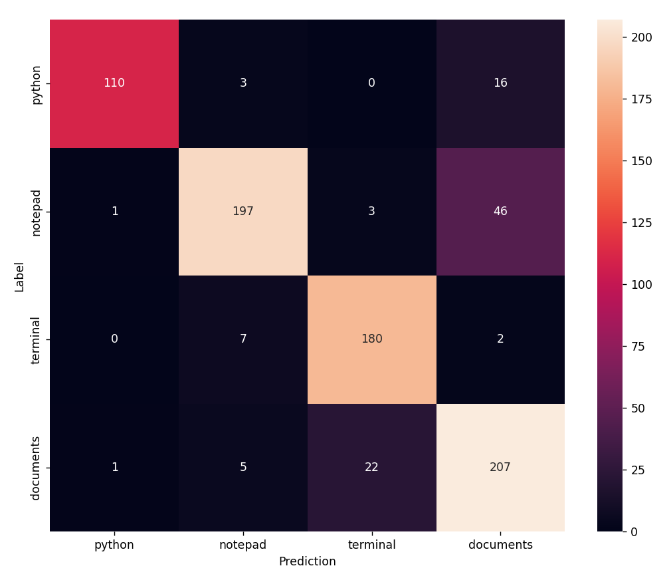

# Voice Launcher (school project)

A Python script for Windows that classifies voice commands and runs shell commands.

<figure>
    
    <figcaption>*Confusion matrix of the trained model*</figcaption>
</figure>

## Usage

The model was trained on four voice commands:

| Voice command | Shell command |
|-|-|
| python | `start /B python -m idlelib` |
| notepad | `start /B notepad` |
| terminal | `start /B wt` |
| documents | `start /B explorer "%userprofile%\Documents"` |

The model was trained on my own voice data, so it might not perform well with your voice. You can use `training/sample_recorder.py` and `training/trainer.py` to record your own samples and retrain the model.

To use the launcher run `main.py` then press <kbd>⊞ Win</kbd>+<kbd>G</kbd> to issue a voice command.

## More information

Further information is available in Slovene language in [the report](docs/report.pdf).